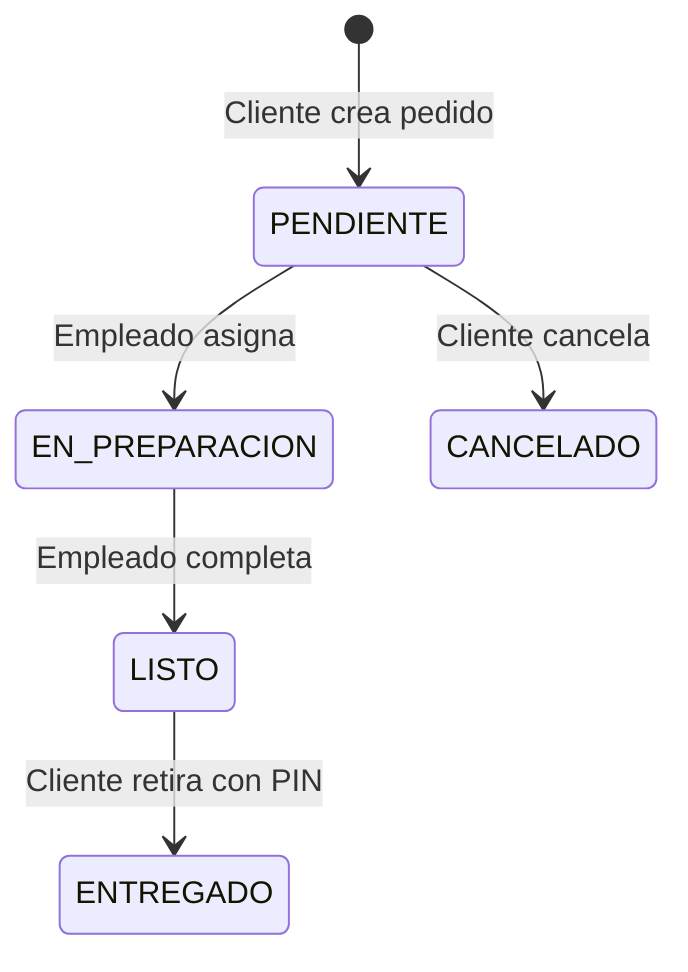

# 📦 Orders Service - Microservicio de Gestión de Pedidos

[](https://adoptium.net/)
[](https://spring.io/projects/spring-boot)
[](https://www.postgresql.org/)
[](https://www.mongodb.com/cloud)
[](https://spring.io/projects/spring-cloud-openfeign)

## 🎯 Descripción

El **Orders Service** es el microservicio central del flujo de pedidos en el sistema de Plazoleta de Comidas. Maneja todo el ciclo de vida de los pedidos, desde su creación hasta la entrega, incluyendo trazabilidad completa y métricas de eficiencia. Implementa una arquitectura híbrida con PostgreSQL para datos transaccionales y MongoDB para trazabilidad.

## 🚀 Estado del Proyecto

✅ **COMPLETAMENTE FUNCIONAL**  
✅ **9 Endpoints** operativos  
✅ **Flujo E2E** PENDIENTE → EN_PREPARACION → LISTO → ENTREGADO  
✅ **Trazabilidad MongoDB** Cloud configurada  
✅ **Métricas en tiempo real** con formato MM:SS  
✅ **OpenFeign Integration** multi-servicio  
✅ **Arquitectura híbrida** PostgreSQL + MongoDB

## 🏗️ Arquitectura

### Patrón Hexagonal (Ports & Adapters)

```
📦 src/main/java/com/pragma/powerup/
├── 🎯 domain/
│   ├── model/          # Order, OrderItem, TraceabilityEvent
│   ├── api/            # Puertos (interfaces)
│   └── usecase/        # Casos de uso de negocio
├── 🔌 infrastructure/
│   ├── input/          # Adaptadores REST Controllers
│   ├── output/         # JPA + MongoDB Repositories
│   ├── feign/          # Clientes OpenFeign
│   ├── configuration/  # Config PostgreSQL + MongoDB
│   └── security/       # Seguridad JWT
└── 🚀 application/     # DTOs, Handlers, Mappers, Utils
```

### Arquitectura de Datos Híbrida

```
🗄️ PostgreSQL (Datos Transaccionales)
├── orders              # Información principal del pedido
├── order_items         # Items individuales del pedido
└── order_assignments   # Asignaciones a empleados

🍃 MongoDB (Trazabilidad y Eventos)
├── traceability_events # Eventos de estado del pedido
├── efficiency_metrics  # Métricas de rendimiento
└── audit_logs         # Logs de auditoría
```

## 📊 Entidades del Dominio

### 📦 Order (PostgreSQL)

```java
@Entity
public class Order {
    private Long id;
    private LocalDateTime date;
    private OrderStatus status;     // PENDIENTE, EN_PREPARACION, LISTO, ENTREGADO, CANCELADO
    private Long customerId;
    private Long restaurantId;
    private Long employeeId;        // Asignado cuando está EN_PREPARACION
    private String pin;             // PIN para retirar pedido
    private LocalDateTime createdAt;
    private LocalDateTime updatedAt;
}
```

### 🛒 OrderItem (PostgreSQL)

```java
@Entity
public class OrderItem {
    private Long id;
    private Long orderId;
    private Long plateId;
    private Integer quantity;
    private BigDecimal unitPrice;
    private BigDecimal totalPrice;
}
```

### 📋 TraceabilityEvent (MongoDB)

```java
@Document(collection = "traceability_events")
public class TraceabilityEvent {
    private String id;
    private Long orderId;
    private String previousStatus;
    private String newStatus;
    private LocalDateTime timestamp;
    private Long employeeId;
    private String employeeName;    // Denormalizado para performance
    private String description;
}
```

## 🔄 Estados del Pedido



### 📱 Transiciones de Estado

-   **PENDIENTE → EN_PREPARACION**: Empleado acepta y se asigna el pedido
-   **EN_PREPARACION → LISTO**: Empleado marca como preparado + SMS al cliente
-   **LISTO → ENTREGADO**: Cliente retira con PIN correcto
-   **PENDIENTE → CANCELADO**: ⚠️ Solo CLIENTE puede cancelar (solo en estado PENDIENTE)

## 🌐 API Endpoints

**Base URL**: `http://localhost:8082/api/v1`

### 📦 Gestión de Pedidos

#### POST `/orders`

**Descripción**: Crear nuevo pedido (HU-011)  
**Acceso**: 👤 Solo CUSTOMER

```bash
POST http://localhost:8082/api/v1/orders
Authorization: Bearer <CUSTOMER_JWT_TOKEN>
Content-Type: application/json

{
  "restaurantId": 1,
  "items": [
    {
      "plateId": 1,
      "quantity": 2
    },
    {
      "plateId": 3,
      "quantity": 1
    }
  ]
}
```

**Response**:

```json
{
    "id": 15,
    "status": "PENDIENTE",
    "restaurantId": 1,
    "totalAmount": 65000,
    "message": "Pedido creado exitosamente"
}
```

#### GET `/orders`

**Descripción**: Listar pedidos por restaurante (HU-012)  
**Acceso**: 👷 EMPLOYEE, 🏪 OWNER

```bash
GET http://localhost:8082/api/v1/orders?restaurantId=1&status=PENDIENTE&page=0&size=10
Authorization: Bearer <EMPLOYEE_JWT_TOKEN>
```

**Response**:

```json
{
    "content": [
        {
            "id": 15,
            "date": "2025-09-02T10:30:00",
            "status": "PENDIENTE",
            "customerId": 3,
            "customerName": "Ana Martínez",
            "items": [
                {
                    "plateId": 1,
                    "plateName": "Hamburguesa Clásica",
                    "quantity": 2,
                    "unitPrice": 20000,
                    "totalPrice": 40000
                }
            ],
            "totalAmount": 65000
        }
    ],
    "totalPages": 1,
    "totalElements": 1
}
```

#### GET `/orders/my-orders`

**Descripción**: Mis pedidos (cliente)  
**Acceso**: 👤 Solo CUSTOMER

```bash
GET http://localhost:8082/api/v1/orders/my-orders?page=0&size=10
Authorization: Bearer <CUSTOMER_JWT_TOKEN>
```

### 🔄 Gestión de Estados

#### PUT `/orders/{id}/assign`

**Descripción**: Asignar pedido a empleado (HU-013)  
**Acceso**: 👷 Solo EMPLOYEE

```bash
PUT http://localhost:8082/api/v1/orders/15/assign
Authorization: Bearer <EMPLOYEE_JWT_TOKEN>
```

**Response**:

```json
{
    "id": 15,
    "status": "EN_PREPARACION",
    "employeeId": 8,
    "message": "Pedido asignado exitosamente"
}
```

#### PUT `/orders/{id}/ready`

**Descripción**: Marcar pedido listo + SMS (HU-016)  
**Acceso**: 👷 Solo EMPLOYEE (asignado)

```bash
PUT http://localhost:8082/api/v1/orders/15/ready
Authorization: Bearer <EMPLOYEE_JWT_TOKEN>
```

**Response**:

```json
{
    "id": 15,
    "status": "LISTO",
    "pin": "475955",
    "message": "Pedido listo - SMS enviado al cliente"
}
```

#### PUT `/orders/{id}/deliver`

**Descripción**: Entregar pedido con PIN (HU-015)  
**Acceso**: 👷 Solo EMPLOYEE

```bash
PUT http://localhost:8082/api/v1/orders/15/deliver
Authorization: Bearer <EMPLOYEE_JWT_TOKEN>
Content-Type: application/json

{
  "pin": "475955"
}
```

**Response**:

```json
{
    "id": 15,
    "status": "ENTREGADO",
    "message": "Pedido entregado exitosamente"
}
```

#### PUT `/orders/{id}/cancel`

**Descripción**: Cancelar pedido (HU-014)  
**Acceso**: 👤 CUSTOMER (solo estado PENDIENTE)

```bash
PUT http://localhost:8082/api/v1/orders/15/cancel
Authorization: Bearer <CUSTOMER_JWT_TOKEN>
```

### 📊 Trazabilidad y Métricas

#### GET `/orders/{id}/traceability`

**Descripción**: Consultar trazabilidad completa (HU-017)  
**Acceso**: 🔀 Control granular por rol

```bash
GET http://localhost:8082/api/v1/orders/15/traceability
Authorization: Bearer <USER_JWT_TOKEN>
```

**Response**:

```json
{
    "orderId": 15,
    "customerId": 3,
    "customerEmail": "ana@cliente.com",
    "restaurantId": 1,
    "events": [
        {
            "id": "64f1a2b3c4d5e6f7a8b9c0d1",
            "previousStatus": null,
            "newStatus": "PENDIENTE",
            "timestamp": "2025-09-02T10:30:00",
            "employeeId": null,
            "employeeName": null,
            "description": "Pedido creado por el cliente"
        },
        {
            "id": "64f1a2b3c4d5e6f7a8b9c0d2",
            "previousStatus": "PENDIENTE",
            "newStatus": "EN_PREPARACION",
            "timestamp": "2025-09-02T10:35:00",
            "employeeId": 8,
            "employeeName": "María López",
            "description": "Pedido asignado al empleado"
        }
    ]
}
```

#### GET `/restaurants/{id}/metrics`

**Descripción**: Métricas de eficiencia en formato MM:SS (HU-018)  
**Acceso**: 🏪 OWNER del restaurante, 👑 ADMIN

```bash
GET http://localhost:8082/api/v1/restaurants/1/metrics
Authorization: Bearer <OWNER_JWT_TOKEN>
```

**Response**:

```json
{
    "restaurantId": 1,
    "restaurantName": "El Buen Sabor",
    "totalOrders": 45,
    "completedOrders": 42,
    "averagePreparationTime": "28:30",
    "employeeMetrics": [
        {
            "employeeId": 8,
            "employeeName": "María López",
            "totalOrders": 25,
            "averageTime": "26:15",
            "efficiencyRank": 1
        },
        {
            "employeeId": 12,
            "employeeName": "Carlos Ruiz",
            "totalOrders": 20,
            "averageTime": "31:45",
            "efficiencyRank": 2
        }
    ],
    "generatedAt": "2025-09-02T15:30:00"
}
```

### 🧪 Endpoints de Testing

#### GET `/orders/test/database`

**Descripción**: Test conexión base de datos  
**Acceso**: 🌐 Público

```bash
GET http://localhost:8082/api/v1/orders/test/database
```

## ✅ Validaciones y Reglas de Negocio

### 📦 Creación de Pedidos

-   ✅ **Cliente autenticado** requerido
-   ✅ **Restaurante válido** (existe y está activo)
-   ✅ **Platos válidos** (existen y están activos)
-   ✅ **Un solo restaurante** por pedido
-   ✅ **Cantidad mínima** 1 por item

### 🔄 Transiciones de Estado

-   ✅ **PENDIENTE → EN_PREPARACION**: Solo empleados del restaurante
-   ✅ **EN_PREPARACION → LISTO**: Solo empleado asignado
-   ✅ **LISTO → ENTREGADO**: PIN correcto requerido
-   ✅ **Cancelación**: Solo en estados PENDIENTE (customer) o EN_PREPARACION (employee)

### 📊 Métricas de Eficiencia

-   ✅ **Control de acceso**: Solo owner del restaurante o admin
-   ✅ **Tiempos reales**: Sin caché, datos siempre actualizados
-   ✅ **Formato MM:SS**: Legible para usuarios finales
-   ✅ **Ranking empleados**: Basado en tiempo promedio

## 🔧 Configuración del Servicio

### Variables de Entorno (.env)

```properties
# Aplicación
SPRING_APPLICATION_NAME=orders-service
PORT=8082

# PostgreSQL (Datos Transaccionales)
DB_URL=jdbc:postgresql://localhost:5432/orders_db
DB_USERNAME=postgres
DB_PASSWORD=postgres
DB_SCHEMA=public

# MongoDB (Trazabilidad)
MONGODB_URI=mongodb://localhost:27017/powerup-traceability
MONGODB_DATABASE=powerup-traceability
MONGODB_USERNAME=
MONGODB_PASSWORD=

# Microservicios
MICROSERVICES_USERS_URL=http://localhost:8081
MICROSERVICES_MESSAGING_URL=http://localhost:8083

# JWT Configuration (COMPARTIDO)
JWT_SECRET=change-me-change-me-change-me-change-me-change-me-change-me
JWT_EXPIRATION=86400000

# Logging
LOGGING_LEVEL_ROOT=INFO
LOGGING_LEVEL_COM_PRAGMA=DEBUG
```

### Base de Datos PostgreSQL

**Database**: `orders_db`

```sql
-- Tabla principal de pedidos
CREATE TABLE orders (
    id BIGSERIAL PRIMARY KEY,
    date TIMESTAMP NOT NULL DEFAULT CURRENT_TIMESTAMP,
    status VARCHAR(20) NOT NULL CHECK (status IN ('PENDIENTE', 'EN_PREPARACION', 'LISTO', 'ENTREGADO', 'CANCELADO')),
    customer_id BIGINT NOT NULL,
    restaurant_id BIGINT NOT NULL,
    employee_id BIGINT,
    pin VARCHAR(6),
    created_at TIMESTAMP DEFAULT CURRENT_TIMESTAMP,
    updated_at TIMESTAMP DEFAULT CURRENT_TIMESTAMP
);

-- Tabla de items del pedido
CREATE TABLE order_items (
    id BIGSERIAL PRIMARY KEY,
    order_id BIGINT NOT NULL REFERENCES orders(id) ON DELETE CASCADE,
    plate_id BIGINT NOT NULL,
    quantity INTEGER NOT NULL CHECK (quantity > 0),
    unit_price DECIMAL(10,2) NOT NULL CHECK (unit_price > 0),
    total_price DECIMAL(10,2) NOT NULL CHECK (total_price > 0)
);

-- Índices para optimización
CREATE INDEX idx_orders_customer_id ON orders(customer_id);
CREATE INDEX idx_orders_restaurant_id ON orders(restaurant_id);
CREATE INDEX idx_orders_employee_id ON orders(employee_id);
CREATE INDEX idx_orders_status ON orders(status);
CREATE INDEX idx_orders_date ON orders(date);
CREATE INDEX idx_order_items_order_id ON order_items(order_id);
CREATE INDEX idx_order_items_plate_id ON order_items(plate_id);
```

### Base de Datos MongoDB

**Database**: `powerup-traceability`

**Colecciones**:

-   `traceability_events`: Eventos de cambio de estado
-   `efficiency_metrics`: Métricas calculadas de empleados
-   `audit_logs`: Logs de auditoría del sistema

## 🔗 Integración con Otros Servicios

### OpenFeign Clients

#### Users Service Client

```java
@FeignClient(name = "users-service", url = "${microservices.users.url}")
public interface UserServiceClient {
    @GetMapping("/api/v1/users/{id}")
    UserResponse getUserById(@PathVariable("id") Long id);
}
```

#### Restaurants Service Client

```java
@FeignClient(name = "restaurants-service", url = "${microservices.restaurants.url}")
public interface RestaurantServiceClient {
    @GetMapping("/api/v1/restaurants/{id}")
    RestaurantResponse getRestaurantById(@PathVariable("id") Long id);

    @GetMapping("/api/v1/plates/{id}")
    PlateResponse getPlateById(@PathVariable("id") Long id);
}
```

#### Messaging Service Client

```java
@FeignClient(name = "messaging-service", url = "${microservices.messaging.url}")
public interface MessagingServiceClient {
    @PostMapping("/api/v1/notifications/sms")
    void sendSMS(@RequestBody SendSMSRequest request);
}
```

## 🧪 Testing

### Flujo E2E Completo

```bash
# 1. Crear pedido (CUSTOMER)
curl -X POST http://localhost:8082/api/v1/orders \
  -H "Authorization: Bearer <CUSTOMER_TOKEN>" \
  -H "Content-Type: application/json" \
  -d '{"restaurantId":1,"items":[{"plateId":1,"quantity":2}]}'

# 2. Asignar pedido (EMPLOYEE)
curl -X PUT http://localhost:8082/api/v1/orders/15/assign \
  -H "Authorization: Bearer <EMPLOYEE_TOKEN>"

# 3. Marcar listo + SMS (EMPLOYEE)
curl -X PUT http://localhost:8082/api/v1/orders/15/ready \
  -H "Authorization: Bearer <EMPLOYEE_TOKEN>"

# 4. Entregar con PIN (EMPLOYEE)
curl -X PUT http://localhost:8082/api/v1/orders/15/deliver \
  -H "Authorization: Bearer <EMPLOYEE_TOKEN>" \
  -H "Content-Type: application/json" \
  -d '{"pin":"475955"}'

# 5. Consultar trazabilidad
curl http://localhost:8082/api/v1/orders/15/traceability \
  -H "Authorization: Bearer <ANY_TOKEN>"
```

### Ejecutar Tests

```bash
# Tests unitarios
./gradlew test

# Tests de integración
./gradlew integrationTest

# Test específico de MongoDB
./gradlew test --tests "*TraceabilityTest"
```

## 🚀 Ejecución del Servicio

### Desarrollo Local

```bash
# 1. Clonar el repositorio
git clone <repository-url>
cd Hexagonal-Orders-Service

# 2. Configurar variables de entorno
cp .env.example .env
# Editar .env con las URLs correctas

# 3. Iniciar PostgreSQL
docker run -d \
  --name postgres-orders \
  -e POSTGRES_DB=orders_db \
  -e POSTGRES_USER=postgres \
  -e POSTGRES_PASSWORD=postgres \
  -p 5434:5432 \
  postgres:15

# 4. Iniciar MongoDB (opcional si usas MongoDB Cloud)
docker run -d \
  --name mongo-traceability \
  -p 27017:27017 \
  mongo:7

# 5. Ejecutar el servicio
./gradlew bootRun
```

### Verificación

```bash
# Health check
curl http://localhost:8082/actuator/health

# Test database connections
curl http://localhost:8082/api/v1/orders/test/database

# Swagger UI
http://localhost:8082/swagger-ui/index.html
```

## 📚 Documentación Adicional

### OpenAPI/Swagger

-   **Swagger UI**: http://localhost:8082/swagger-ui/index.html
-   **OpenAPI Spec**: [docs/openapi/orders.yaml](./docs/openapi/orders.yaml)

### Diagramas

-   [Flujo de Estados](./docs/diagrams/)
-   [Historias de Usuario](./docs/HU/)

## 🏆 Historias de Usuario Implementadas

-   ✅ **HU-011**: Realizar Pedido (CUSTOMER)
-   ✅ **HU-012**: Listar Pedidos (EMPLOYEE/OWNER)
-   ✅ **HU-013**: Asignar Pedido a Empleado (EMPLOYEE)
-   ✅ **HU-014**: Cambiar Estado de Pedido (VARIOUS)
-   ✅ **HU-015**: Entregar Pedido (EMPLOYEE)
-   ✅ **HU-016**: Marcar Pedido Listo (EMPLOYEE)
-   ✅ **HU-017**: Consultar Trazabilidad (ALL)
-   ✅ **HU-018**: Consultar Eficiencia (OWNER/ADMIN)

## 🎯 Características Destacadas

### 📱 SMS Integration

-   **Notificación automática** cuando el pedido está LISTO
-   **PIN único** para retirar el pedido
-   **Twilio SMS** vía Messaging Service

### 📊 Métricas en Tiempo Real

-   **Formato MM:SS** para legibilidad
-   **Ranking de empleados** por eficiencia
-   **Datos híbridos** PostgreSQL + MongoDB

### 🔍 Trazabilidad Completa

-   **Eventos detallados** en MongoDB
-   **Control de acceso granular** por rol
-   **Información enriquecida** con nombres de empleados
